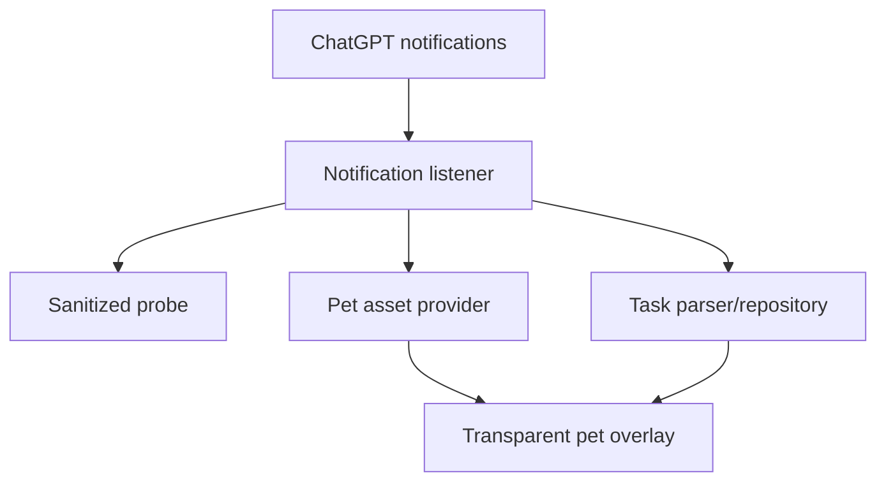

# Codex Pet for Android

Отдельное local-only Android-приложение, которое показывает выбранного ChatGPT/Codex pet как прозрачный `TYPE_APPLICATION_OVERLAY`, без системного белого bubble-круга, маски и badge ChatGPT.

Проект не модифицирует ChatGPT, не использует root, Accessibility, Shizuku, hooking, приватные файлы ChatGPT или закрытые OpenAI API. Источник состояния — только публичный Android notification API.

> Текущий стабильный релиз: `0.4.0`. Базовая интеграция остаётся notification-driven: фактически доступные icon/extras могут меняться между версиями ChatGPT и Android, поэтому приложение хранит только санитизированную диагностику и честно показывает выбранный источник.

## Что уже реализовано

- Android 11–16: `minSdk 30`, `targetSdk 36`.
- Kotlin, native Views, без тяжёлого UI-фреймворка.
- `NotificationListenerService`, фильтрующий настраиваемый package; по умолчанию `com.openai.chatgpt`.
- Probe для notification metadata, extras, BubbleMetadata, PendingIntent, Drawable, bitmap alpha и SHA-256.
- Поиск pet в порядке:
  1. `BubbleMetadata.icon`;
  2. AndroidX `MessagingStyle` Person icon;
  3. `Notification.getLargeIcon()`;
  4. ручной PNG/WebP/WebP-atlas или безопасный ZIP import.
- Проверка прозрачности до автоматического принятия изображения. Adaptive icon mask не применяется; при `AdaptiveIconDrawable` анализируется foreground.
- Автоматическое обновление pet при изменении bitmap hash.
- Локальный cache: PNG, hash, timestamp, asset source и source package. Текст бесед на диск не сохраняется.
- Прозрачный `TYPE_APPLICATION_OVERLAY` с `PixelFormat.TRANSLUCENT`, без background, crop, badge, shadow и elevation.
- Drag, безопасные границы экрана/cutout, snap к краю и отдельные позиции portrait/landscape.
- Встроенный v2 Violet Vixen pack: 9 анимационных состояний и 16 направлений взгляда.
- Single tap: компактные comic-style реплики, геометрически привязанные к pet; без большой панели.
- До пяти реплик одновременно с независимым масштабом; при drag и edge snap существующие overlay-окна перемещаются через `updateViewLayout`, без remove/add на каждом кадре.
- При большем числе событий страницы реплик автоматически ротируются; тап открывает именно соответствующий ChatGPT PendingIntent.
- Общий быстрый выключатель авто-реплик действительно отключает и Codex, и обычные ChatGPT chat notifications.
- Срок жизни контекста различается: chat/completed — таймер, running — пока активен, needs-input/error/disconnected — до разрешения или удаления notification.
- Long press: ChatGPT, настройки или скрытие.
- Task parsing с приоритетом structured progress → ongoing flag → только затем текстовые эвристики.
- Переход к задаче через `contentIntent` → bubble intent → launcher ChatGPT.
- Девять исходных sprite-анимаций без transform-анимаций; native `Animatable` также запускается без системной маски.
- ZIP reader не извлекает пути на файловую систему, запрещает traversal и ограничивает entries/распакованный размер.
- `specialUse` foreground service с пользовательским постоянным notification.
- Onboarding, permission status, отключение стандартных ChatGPT bubbles и инструкции для HONOR/MagicOS.
- Санитизированный JSON export. Полный notification text не входит в export ни в одном build type.
- В manifest отсутствует `INTERNET`; нет analytics, telemetry, Firebase, ads или backend.

## Быстрый запуск и проверка

1. Установите APK и откройте Codex Pet.
2. Включите доступ к уведомлениям.
3. Разрешите отображение поверх других приложений.
4. На Android 13+ разрешите notification Codex Pet для foreground service.
5. Запустите Codex Pet.
6. В ChatGPT откройте Codex Remote или запустите задачу, чтобы появилась/обновилась notification.
7. Для проверки источников откройте diagnostics, обновите активные notifications и при необходимости сохраните sanitized JSON.

Успешный минимальный результат:

- metadata/extras и доступные публичные icon candidates зафиксированы без текста переписки;
- выбранный кандидат имеет alpha и проходит transparency gate;
- diagnostics показывает фактический source, Drawable/bitmap geometry и hash;
- несколько анимационных notification-кадров одного персонажа не принимаются за смену pet; полный sprite pack берётся из встроенного либо импортированного ассета.

Полный эксперимент описан в [docs/phase-0-test-plan.md](docs/phase-0-test-plan.md).

## Архитектура



Подробнее: [docs/architecture.md](docs/architecture.md).

## Приватность и permissions

Объявлены только:

- `SYSTEM_ALERT_WINDOW`;
- `BIND_NOTIFICATION_LISTENER_SERVICE` на самом listener service;
- `FOREGROUND_SERVICE` и `FOREGROUND_SERVICE_SPECIAL_USE`;
- `POST_NOTIFICATIONS`;
- `RECEIVE_BOOT_COMPLETED`.

`<queries>` содержит только `com.openai.chatgpt`. `INTERNET`, storage, contacts, SMS, location, camera, microphone и `QUERY_ALL_PACKAGES` не объявлены. Политика обработки данных: [docs/privacy.md](docs/privacy.md).

## Сборка

Требования:

- JDK 17;
- Android SDK Platform 36;
- Android SDK Build Tools 35.0.0 или новее.

Debug-проверка:

```bash
./gradlew testDebugUnitTest lintDebug assembleDebug
```

Release candidate с R8/resource shrinking:

```bash
./gradlew assembleRelease
```

CI на pull request и non-main ветках собирает unsigned release candidate. На `main` используется production signing, если настроен полный набор secrets:

- `CODEX_PET_KEYSTORE_BASE64`;
- `CODEX_PET_KEYSTORE_PASSWORD`;
- `CODEX_PET_KEY_ALIAS`;
- `CODEX_PET_KEY_PASSWORD`.

При наличии signing CI проверяет итоговый APK через `apksigner verify`; если signing не настроен, artifact явно публикуется как unsigned.

## HONOR X9c / MagicOS 9–10

После установки выполните шаги в [docs/magicos.md](docs/magicos.md). Приложение использует только public Android settings intents; private HONOR API не вызываются.

## Важные ограничения

- Android notification API может содержать меньше задач, чем внутренняя activity-панель ChatGPT. Приложение не выдумывает отсутствующие задачи.
- Официальная документация ChatGPT описывает desktop activity tray отдельно от системных notifications; равенство этих наборов данных не предполагается.
- Отключение системных bubbles может повлиять на наличие `BubbleMetadata`; это проверяется отдельным шагом диагностики.
- Если ни один публичный icon source не содержит чистого pet, приложение показывает точную диагностическую причину и предлагает manual import. Accessibility, root и hooking намеренно отсутствуют.
- Автозапуск после reboot — best effort: Android и MagicOS могут запретить background FGS start. Ошибка не приводит к crash; pet можно запустить из Activity.

## Официальные ссылки

- [OpenAI: Pets](https://learn.chatgpt.com/docs/pets)
- [Android: NotificationListenerService](https://developer.android.com/reference/android/service/notification/NotificationListenerService)
- [Android: Notification.BubbleMetadata](https://developer.android.com/reference/android/app/Notification.BubbleMetadata)
- [Android: foreground service types](https://developer.android.com/develop/background-work/services/fgs/service-types)
- [Android: background FGS restrictions](https://developer.android.com/develop/background-work/services/fgs/restrictions-bg-start)
- [HONOR: keeping an app running in background](https://www.honor.com/global/support/content/en-us00406916/)

## Release notes

- [0.4.0](docs/releases/0.4.0.md)
- [0.3.0-beta1](docs/releases/0.3.0-beta1.md)

## License

Apache-2.0. См. [LICENSE](LICENSE).
