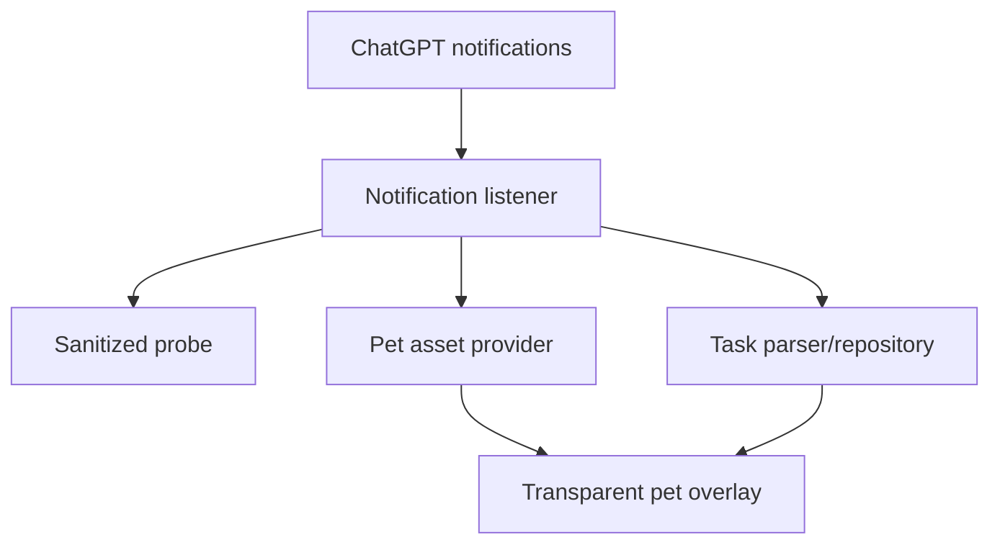

# Codex Pet for Android

Отдельное local-only Android-приложение, которое показывает выбранного ChatGPT/Codex pet как прозрачный `TYPE_APPLICATION_OVERLAY`, без системного белого bubble-круга, маски и badge ChatGPT.

Проект не модифицирует ChatGPT, не использует root, Accessibility, Shizuku, hooking, приватные файлы ChatGPT или закрытые OpenAI API. Источник состояния — только публичный Android notification API.

> Текущий статус: `0.1.0-phase0`. Код диагностического probe, auto-sync, overlay и панели задач реализован и собирается. Главная гипотеза о содержимом реального `BubbleMetadata.icon` ещё должна быть подтверждена на HONOR X9c с текущей версией ChatGPT. До этого auto-sync нельзя считать доказанным на устройстве.

## Что уже реализовано

- Android 11–16: `minSdk 30`, `targetSdk 36`.
- Kotlin, native Views, без тяжёлого UI-фреймворка.
- `NotificationListenerService`, фильтрующий настраиваемый package; по умолчанию `com.openai.chatgpt`.
- Phase 0 probe для notification metadata, extras, BubbleMetadata, PendingIntent, Drawable, bitmap alpha и SHA-256.
- Поиск pet в порядке:
  1. `BubbleMetadata.icon`;
  2. AndroidX `MessagingStyle` Person icon;
  3. `Notification.getLargeIcon()`;
  4. ручной PNG/WebP import только как явно обозначенный fallback.
- Проверка прозрачности до автоматического принятия изображения. Adaptive icon mask не применяется; при `AdaptiveIconDrawable` анализируется foreground.
- Автоматическое обновление pet при изменении bitmap hash.
- Локальный cache: PNG, hash, timestamp, asset source и source package. Текст бесед на диск не сохраняется.
- Прозрачный `TYPE_APPLICATION_OVERLAY` с `PixelFormat.TRANSLUCENT`, без background, crop, badge, shadow и elevation.
- Drag, безопасные границы экрана/cutout, snap к краю и отдельные позиции portrait/landscape.
- Single tap: компактная собственная панель задач.
- Long press: ChatGPT, настройки, diagnostics или скрытие.
- Task parsing с приоритетом structured progress → ongoing flag → только затем текстовые эвристики.
- Переход к задаче через `contentIntent` → bubble intent → launcher ChatGPT.
- Состояния `IDLE`, `RUNNING`, `SUCCESS`, `ERROR` и ненавязчивые transform-анимации; native `Animatable` запускается без преобразования в системную маску.
- `specialUse` foreground service с пользовательским постоянным notification.
- Onboarding, permission status, отключение стандартных ChatGPT bubbles и инструкции для HONOR/MagicOS.
- Санитизированный JSON export. Полный notification text не входит в export ни в одном build type.
- В manifest отсутствует `INTERNET`; нет analytics, telemetry, Firebase, ads или backend.

## Быстрый запуск Phase 0

1. Установите `app-debug.apk` и откройте Codex Pet.
2. Включите доступ к уведомлениям.
3. Разрешите отображение поверх других приложений.
4. На Android 13+ разрешите notification Codex Pet для foreground service.
5. Запустите Codex Pet.
6. В ChatGPT откройте Codex Remote или запустите задачу, чтобы появилась/обновилась bubble notification.
7. Откройте `Diagnostics → ChatGPT notifications`, нажмите `Refresh active notifications` и сохраните sanitized JSON.

Успешный минимальный результат Phase 0:

- `bubble.exists = true`;
- `bubble.iconExists = true`;
- кандидат `BUBBLE_ICON` имеет ожидаемый `Icon.type` и Drawable;
- углы/часть пикселей прозрачны;
- `acceptedForOverlay = true`;
- hash меняется после реальной смены pet, но не из-за системного белого круга.

Полный эксперимент описан в [docs/phase-0-test-plan.md](docs/phase-0-test-plan.md).

## Архитектура



Подробнее: [docs/architecture.md](docs/architecture.md).

## Приватность и permissions

Объявлены только:

- `SYSTEM_ALERT_WINDOW`;
- `BIND_NOTIFICATION_LISTENER_SERVICE` на самом listener service;
- `FOREGROUND_SERVICE` и `FOREGROUND_SERVICE_SPECIAL_USE`;
- `POST_NOTIFICATIONS`;
- `RECEIVE_BOOT_COMPLETED`.

`<queries>` содержит только `com.openai.chatgpt`. `INTERNET`, storage, contacts, SMS, location, camera, microphone и `QUERY_ALL_PACKAGES` не объявлены. Политика обработки данных: [docs/privacy.md](docs/privacy.md).

## Сборка

Требования:

- JDK 17;
- Android SDK Platform 36;
- Android SDK Build Tools 35.0.0 или новее.

```bash
./gradlew testDebugUnitTest lintDebug assembleDebug
```

APK появится в `app/build/outputs/apk/debug/app-debug.apk`.

## HONOR X9c / MagicOS 9–10

После установки выполните шаги в [docs/magicos.md](docs/magicos.md). Приложение использует только public Android settings intents; private HONOR API не вызываются.

## Важные ограничения

- Android notification API может содержать меньше задач, чем внутренняя activity-панель ChatGPT. Приложение не выдумывает отсутствующие задачи.
- Официальная документация ChatGPT описывает desktop activity tray отдельно от системных notifications; равенство этих наборов данных не предполагается.
- Отключение системных bubbles может повлиять на наличие `BubbleMetadata`; это проверяется отдельным шагом Phase 0.
- Если ни один публичный icon source не содержит чистого pet, приложение показывает точную диагностическую причину и предлагает manual import. Accessibility, root и hooking намеренно отсутствуют.
- Автозапуск после reboot — best effort: Android и MagicOS могут запретить background FGS start. Ошибка не приводит к crash; pet можно запустить из Activity.

## Официальные ссылки

- [OpenAI: Pets](https://learn.chatgpt.com/docs/pets)
- [Android: NotificationListenerService](https://developer.android.com/reference/android/service/notification/NotificationListenerService)
- [Android: Notification.BubbleMetadata](https://developer.android.com/reference/android/app/Notification.BubbleMetadata)
- [Android: foreground service types](https://developer.android.com/develop/background-work/services/fgs/service-types)
- [Android: background FGS restrictions](https://developer.android.com/develop/background-work/services/fgs/restrictions-bg-start)
- [HONOR: keeping an app running in background](https://www.honor.com/global/support/content/en-us00406916/)

## License

Apache-2.0. См. [LICENSE](LICENSE).
