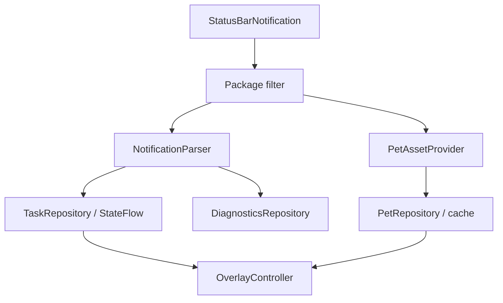
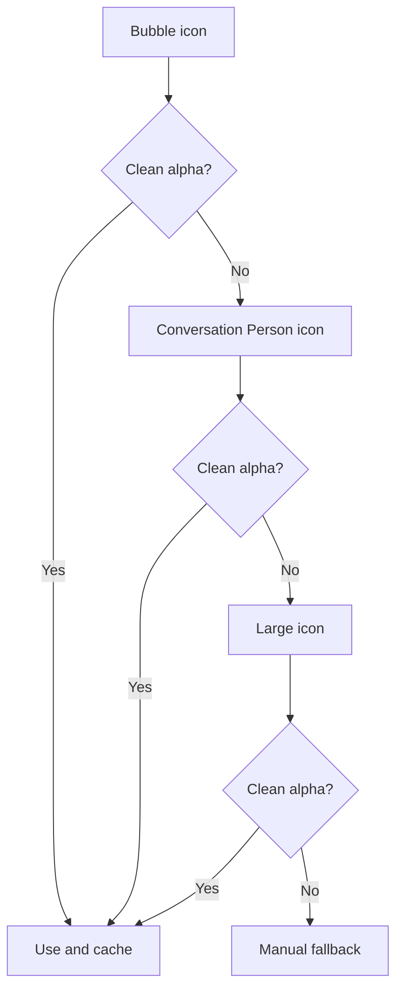

# Архитектура

## Потоки данных

`ChatGptNotificationListener` обрабатывает только package из `SettingsRepository`. По умолчанию это `com.openai.chatgpt`. Source можно изменить без замены parser/repository/overlay.

## Phase 0 probe

На каждый notification event создаётся in-memory `NotificationSnapshot`:

- identity и grouping metadata;
- список extras keys;
- только наличие/длина чувствительных text extras;
- progress/ongoing signals;
- BubbleMetadata и PendingIntent presence;
- icon/Drawable/bitmap diagnostics;
- parser notes.

В debug build на диагностическом экране text extras доступны в памяти до закрытия процесса/очистки snapshots. Export всегда отбрасывает эти значения.

## Pet asset selection

Safety gate требует alpha channel, не менее 2% полностью прозрачных pixels и минимум два прозрачных угла. Это эвристика обнаружения уже запечённого background, а не доказательство семантики изображения; Phase 0 всё равно обязателен.

Adaptive icon не circle-crop-ится. Анализируется foreground Drawable до системной маски. Для native `Animatable` оригинальный Drawable остаётся в памяти и запускается; disk cache хранит безопасный статический PNG frame.

## Task model

Одна notification не считается автоматически одной пользовательской задачей. Stable identity выбирается как `shortcutId`, иначе notification key. Несколько notifications с одним stable id дедуплицируются по `updatedAt`.

InboxStyle lines не превращаются в отдельные задачи без стабильных identifiers. Group summary остаётся агрегатом. Status priority:

1. indeterminate/partial progress;
2. completed structured progress;
3. `FLAG_ONGOING_EVENT`;
4. локальные текстовые эвристики;
5. `UNKNOWN`.

## Overlay lifecycle

`OverlayService` — пользовательски включаемый `specialUse` foreground service. Он создаёт pet window до вызова `startForeground()` внутри service, использует `START_STICKY`, восстанавливает настройки из DataStore и не зависит от открытой Activity.

Boot receiver запускает overlay только когда пользователь заранее включил обе опции `overlayEnabled` и `autoStart`. Любой запрет Android/MagicOS обрабатывается без crash и сохраняется только как диагностический класс ошибки.

## Trust boundaries

- PendingIntent не разбирается и не модифицируется; вызывается объект, опубликованный ChatGPT.
- Приложение не читает private ChatGPT storage.
- Нет сетевого permission и backend.
- Нет Accessibility, root, Shizuku, Xposed/LSPosed или packet interception.
