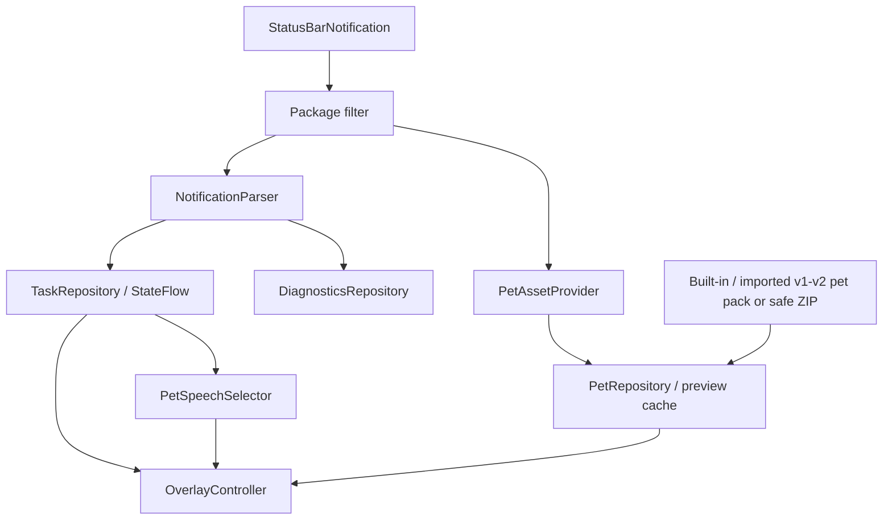
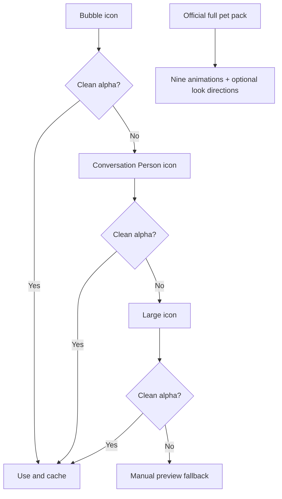

# Архитектура

## Потоки данных

`ChatGptNotificationListener` обрабатывает только package из `SettingsRepository`. По умолчанию это `com.openai.chatgpt`. Source можно изменить без замены parser/repository/overlay.

## Phase 0 probe

На каждый notification event создаётся in-memory `NotificationSnapshot`:

- identity и grouping metadata;
- список extras keys;
- только наличие/длина чувствительных text extras;
- progress/ongoing signals;
- BubbleMetadata и PendingIntent presence;
- icon/Drawable/bitmap diagnostics;
- parser notes.

В debug build на диагностическом экране text extras доступны в памяти до закрытия процесса/очистки snapshots. Export всегда отбрасывает эти значения.

## Pet asset selection

Safety gate требует alpha channel, не менее 2% полностью прозрачных pixels и минимум два прозрачных угла. Это эвристика обнаружения уже запечённого background, а не доказательство семантики изображения; Phase 0 всё равно обязателен.

Adaptive icon не circle-crop-ится. Анализируется foreground Drawable до системной маски. Поток avatar-кадров не используется для реконструкции закрытого sprite sheet: visual fingerprint отличает анимационный кадр от реальной смены персонажа. Для полного набора поддерживается исходная геометрия официального v1/v2 pack без transform-анимаций.

## Task model

Одна notification не считается автоматически одной пользовательской задачей. Stable identity выбирается как `shortcutId`, иначе notification key. Несколько notifications с одним stable id дедуплицируются по `updatedAt`.

InboxStyle lines не превращаются в отдельные задачи без стабильных identifiers. Group summary остаётся агрегатом. Status priority:

1. indeterminate/partial progress;
2. completed structured progress;
3. `FLAG_ONGOING_EVENT`;
4. локальные текстовые эвристики;
5. `UNKNOWN`.

Notification channel `codex_remote_session` классифицируется как Codex task, `.avatar` — как скрытый pet/deep-link controller. Другие notifications настроенного ChatGPT package становятся `CHAT_MESSAGE`: они могут отображаться как короткая comic-style реплика и открываться через собственный PendingIntent, но не считаются Codex-задачами.

Выбор анимации выполняется отдельно: последняя конкретная RU/EN-эвристика актуального текста имеет приоритет над coarse structured status. Полная матрица описана в `docs/animation-mapping.md`.

`PetSpeechSelector` использует порядок `needs input → blocked → ready → running`. В overlay одновременно существует одно небольшое speech-window; несколько значимых notifications циклически меняют его содержимое без пересоздания окна. `contentIntent` остаётся привязан к текущей реплике. Master switch foreground-notification подавляет все автоматические категории; ручной tap pet всё ещё позволяет посмотреть текущий контекст.

Транзиентные `CHAT_MESSAGE` и `COMPLETED` имеют deadline. `RUNNING`, `WAITING_FOR_INPUT`, `FAILED` и `DISCONNECTED` не получают искусственного таймера и исчезают при реальном изменении/удалении исходной notification.

## Overlay lifecycle

`OverlayService` — пользовательски включаемый `specialUse` foreground service. Сначала он публикует обязательное foreground notification, затем создаёт pet window, использует `START_STICKY`, восстанавливает настройки из DataStore и не зависит от открытой Activity.

Boot receiver запускает overlay только когда пользователь заранее включил обе опции `overlayEnabled` и `autoStart`. Любой запрет Android/MagicOS обрабатывается без crash и сохраняется только как диагностический класс ошибки.

## Trust boundaries

- PendingIntent не разбирается и не модифицируется; вызывается объект, опубликованный ChatGPT.
- Приложение не читает private ChatGPT storage.
- Нет сетевого permission и backend.
- Нет Accessibility, root, Shizuku, Xposed/LSPosed или packet interception.
